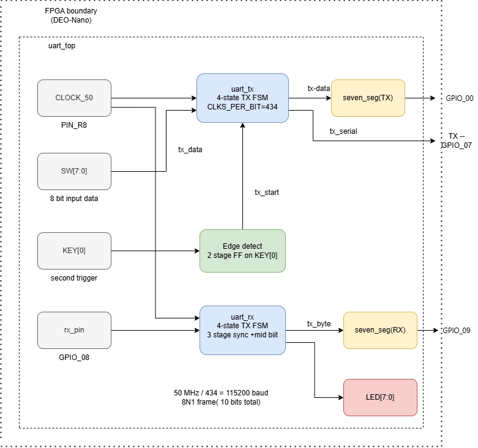

# UART Transceiver in Verilog (FPGA)

## 📌 Overview

This project implements a complete UART Transmitter and Receiver using Verilog HDL.
It supports serial communication with configurable baud rate and includes FPGA integration.

---

## 🧩 System Block Diagram

## ⚙️ Features

* UART TX & RX FSM design
* 8-bit serial communication
* Configurable baud rate (`CLKS_PER_BIT`)
* Start and Stop bit handling
* Receiver synchronization (3-stage)
* Testbench with multiple patterns
* FPGA top module with LEDs & 7-segment display

---

## 🧠 FSM Design

### Transmitter

IDLE → START → DATA → STOP

### Receiver

IDLE → START → DATA → STOP

---

## 📁 Project Structure

src/

* uart_tx.v
* uart_rx.v
* seven_seg.v
* uart_top.v

tb/

* uart_tb.v

---

## 🧪 Simulation

Run using ModelSim / Vivado:

vsim uart_tb
run -all

---

## 🧪 Test Patterns

* A5
* 3C
* FF
* 00
* 5A
* 81

---

## 🔌 FPGA Implementation

* Switches → Data input
* Button → Trigger transmission
* LEDs → Received data
* 7-Segment → Hex display

---

## 🚀 Author

Oshadha Vihanga Perera

---

## 📜 License

MIT License
